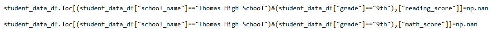
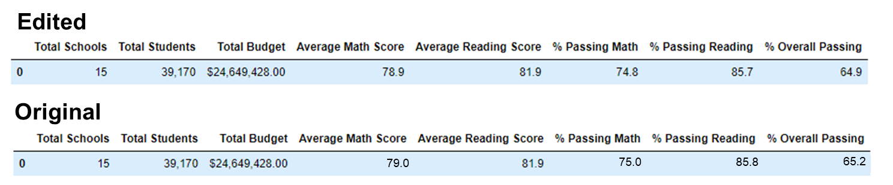
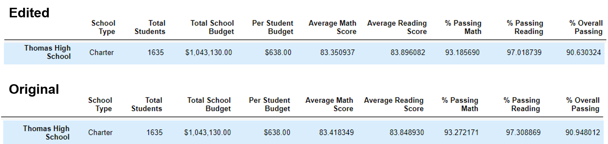

# School_District_Analysis

## I. Overview of Project

### Background
Maria, the chief data scientist of the city school district, was tasked with analyzing data on student funding and standardized test scores in order to showcase trends and pattern.

### Objective
After the analysis, it was discovered that grades for Thomas High School ninth graders appear to have been altered. Now, the goal is to replace the math and reading scores for Thomas High School with NaNs while keeping the rest of the data intact, then repeat the school district analysis and report how the changes affected the overall analysis.

## II. [Analysis and Results](PyCitySchools_Challenge.ipynb)

The Math and Reading scores were replaced with NaNs using:

### A. Effect on District Summary

The new edited values are slightly lower than the original values. The District % Overall Passing became lower by 0.3.

### B. Effect on School Summary

The school performance also became slightly lower than the orginal values. The school's % Overall Passing also became lower by 0.3.

### C. Thomas High School’s performance relative to the other schools

For Thomas High School's performance relative to other schools, it retained the Top 2 spot even with a lower % Overall Passing.

### D. How does replacing the ninth-grade scores affect the following:

  -Math and reading scores by grade
  
  -Scores by school spending
  
  -Scores by school size
  
  -Scores by school type

## III. Summary

Summarize four changes in the updated school district analysis after reading and math scores for the ninth grade at Thomas High School have been replaced with NaNs.

