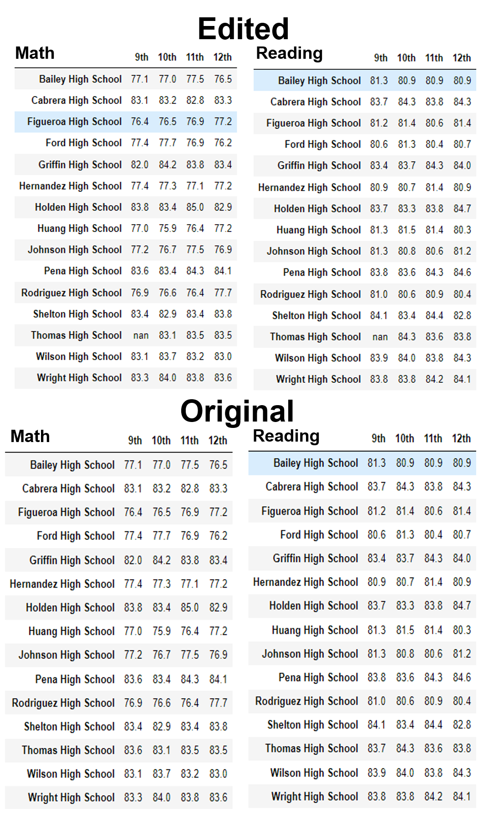
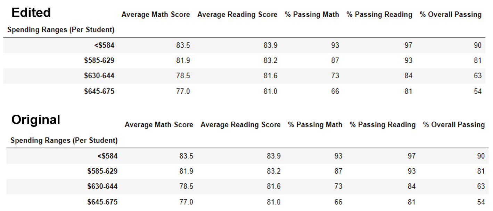
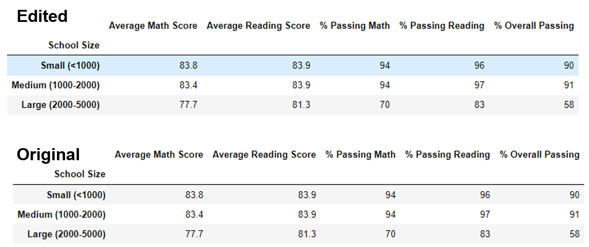
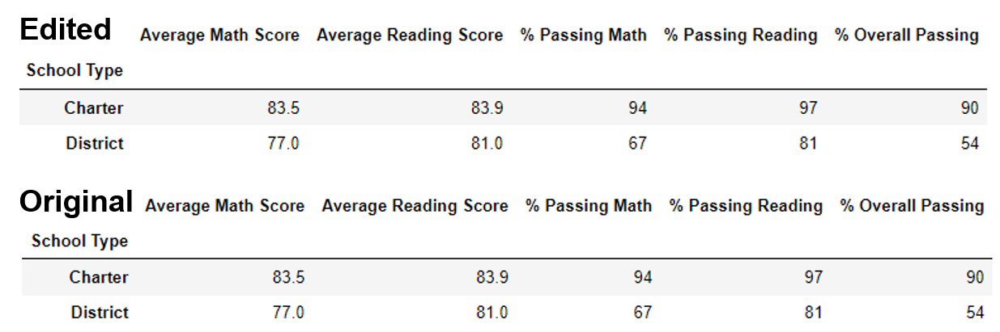

# School_District_Analysis

## I. Overview of Project

### Background
Maria, the chief data scientist of the city school district, was tasked with analyzing data on student funding and standardized test scores in order to showcase trends and pattern.

### Objective
After the analysis, it was discovered that grades for Thomas High School ninth graders appear to have been altered. Now, the goal is to replace the math and reading scores for Thomas High School with NaNs while keeping the rest of the data intact, then repeat the school district analysis and report how the changes affected the overall analysis.

## II. [Analysis and Results](PyCitySchools_Challenge.ipynb)

The Math and Reading scores were replaced with NaNs using:

### A. Effect on District Summary

The new edited values are slightly lower than the original values for Average Math Score, % Passing Math, and % Passing Reading. The major change is that the District % Overall Passing became lower by 0.3.

### B. Effect on School Summary

The school performance also became slightly lower than the orginal values for Average Math Score, % Passing Math, and % Passing Reading. This time, the average reading score became slightly higher. The major change is the school's % Overall Passing became lower by 0.3.

### C. Thomas High School’s performance relative to the other schools

For Thomas High School's performance relative to other schools, it retained the Top 2 spot even with a lower % Overall Passing.

### D. Replacing the ninth-grade scores effect on the following:

  - **Math and reading scores by grade**
  
  
  
  The 9th graders' math and reading scores are just replaced by NaN.
  
  - **Scores by school spending**
   
  
  
  There is no change for the scores by school spending.
  
  - **Scores by school size**
  
  
  
  There is no change for the scores by school size.
  
  - **Scores by school type**

  

  There is no change for the scores by school type.

## III. Summary

After replacing the Thomas High School 9th graders' grades with NaN, there were **no changes for THS performance ranking, scores by school spending, scores by school size, and scores by school type. The changes were obeserved in the district summary and school summary. Most of the values became slightly lower except for average reading scores. The biggest changest are observed in the % Overall Passing for district summary and school summary, where both values became lower by 0.3.

